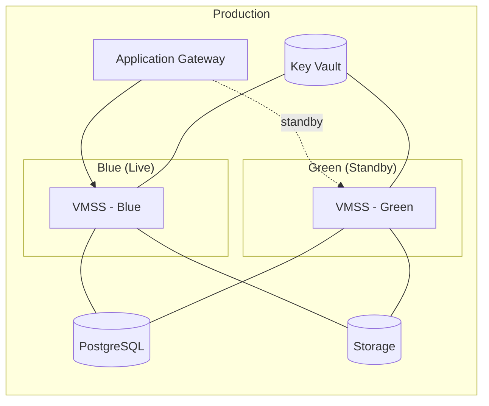

# Azure Infrastructure Patterns - Enterprise DORA Implementation

> **Elite DevOps Infrastructure following DORA best practices for Azure VMSS, PostgreSQL, and Storage**

## 🎯 Project Context for GitHub Copilot

**Current State**: Terraform-managed Azure infrastructure with GitLab pipelines (dev → prod)  
**Target State**: Blue-green deployments with immutable infrastructure and elite DORA metrics  
**Constraints**: Cannot use AKS/Kubernetes - must use VMSS, Azure Storage, PostgreSQL  
**Infrastructure**: VMSS + Application Gateway + PostgreSQL + Storage + Key Vault + Monitoring

---

## 🚀 Quick Start Guide

### Prerequisites

- Azure CLI installed and logged in
- Terraform >= 1.6.0
- GitLab CI/CD access
- VS Code with GitHub Copilot

### Setup Instructions

#### 1. Clone and Discover Current Infrastructure

```bash
# Clone this repository
git clone https://github.com/YOUR_USERNAME/azure-infrastructure-patterns.git
cd azure-infrastructure-patterns

# Login to Azure and set subscription
az login
az account set --subscription "YOUR_SUBSCRIPTION_ID"

# Discover existing infrastructure (SAFE - read-only commands)
./scripts/setup/discover-current-setup.sh

# Review discovery results
cat discovery-output/SUMMARY.md
ls discovery-output/
```

#### 2. Use GitHub Copilot for Analysis

Open VS Code with both your existing Terraform files AND this repository, then use these prompts:

```text
@workspace Analyze my existing Azure infrastructure and explain the current architecture

Help me understand how to implement blue-green deployments with my current VMSS setup

Based on my discovery-output files, customize terraform.tfvars.example with my actual values

Create a migration plan from my current infrastructure to these modern patterns

Explain the security improvements these templates provide over my current setup
```

#### 3. Customize Configuration

```bash
# Find all customization points
grep -r "TODO:" . --exclude-dir=.git

# Start with development environment
cp terraform/environments/dev/terraform.tfvars.example terraform/environments/dev/terraform.tfvars

# Use GitHub Copilot to help fill in your actual values
```

---

## 🏗️ Architecture Overview

### Target Blue-Green Architecture



### Key Components

- **Virtual Machine Scale Sets (VMSS)** - Auto-scaling compute with blue-green capability
- **Application Gateway** - Load balancer with backend pool switching
- **Azure Database for PostgreSQL** - Managed database service
- **Azure Storage** - Blob, file, and queue storage
- **Key Vault** - Secrets and certificate management
- **Log Analytics** - Centralized logging and monitoring

---

## 🛡️ Security & Compliance

### Security Design Principles

- **Defense in Depth**: Multiple security layers
- **Zero Trust**: Verify everything, trust nothing
- **Least Privilege**: Minimal required permissions
- **Encryption Everywhere**: At rest and in transit

### Compliance Features

- ✅ CIS benchmark compliance
- ✅ Network segmentation with NSGs
- ✅ Private endpoints for PaaS services
- ✅ Azure Key Vault integration
- ✅ Automated security scanning in CI/CD

---

## 📊 DORA Metrics Implementation

| Metric                    | Implementation                | Target           |
| ------------------------- | ----------------------------- | ---------------- |
| **Deployment Frequency**  | Blue-green via GitLab CI/CD   | Multiple per day |
| **Lead Time for Changes** | Immutable images + automation | < 1 hour         |
| **Change Failure Rate**   | Staging validation + rollback | < 5%             |
| **Mean Time to Recovery** | Instant traffic switching     | < 10 minutes     |

---

## 📁 Repository Structure

```
├── terraform/                  # Infrastructure as Code
│   ├── modules/                # Reusable Terraform modules
│   │   ├── networking/         # VNet, subnets, NSGs
│   │   ├── compute/            # VMSS with blue-green
│   │   ├── database/           # PostgreSQL configuration
│   │   ├── storage/            # Storage accounts
│   │   ├── security/           # Key Vault, managed identities
│   │   └── monitoring/         # Log Analytics, dashboards
│   ├── environments/           # Environment-specific configs
│   │   ├── dev/                # Development environment
│   │   ├── staging/            # Staging with blue-green
│   │   └── prod/               # Production with blue-green
│   └── shared/                 # Shared infrastructure
├── packer/                     # VM image building
│   ├── windows/                # Windows Server templates
│   └── shared/                 # Common configurations
├── pipelines/                  # CI/CD configurations
│   ├── gitlab/                 # GitLab CI templates
│   └── scripts/                # Deployment automation
├── scripts/                    # Utility and setup scripts
│   ├── setup/                  # Infrastructure discovery
│   ├── deployment/             # Blue-green automation
│   └── maintenance/            # Operational scripts
├── docs/                       # Documentation
│   ├── architecture/           # Architecture decisions
│   ├── runbooks/               # Operational procedures
│   └── best-practices/         # Implementation guides
└── monitoring/                 # Observability
    ├── dashboards/             # Azure Monitor dashboards
    ├── alerts/                 # Alerting rules
    └── queries/                # KQL queries
```

---

## 🔄 Deployment Workflow

### Development Process

1. **Code Changes** → Push to GitLab
2. **Pipeline Triggers** → Automated validation
3. **Terraform Plan** → Review infrastructure changes
4. **Security Scan** → Vulnerability assessment
5. **Deploy Dev** → Automated deployment
6. **Integration Tests** → Validate functionality

### Production Deployment

1. **Staging Validation** → Blue-green testing
2. **Business Approval** → Change management
3. **Production Deploy** → Blue-green to prod
4. **Traffic Switch** → Gradual migration
5. **Monitoring** → Health validation
6. **Rollback Ready** → Instant if needed

---

## 🤖 GitHub Copilot Prompt Library

### Understanding Current Infrastructure

```text
@workspace Analyze my existing Terraform files and explain the current Azure architecture

What are the main differences between my current setup and these best practice templates?

Help me identify which resources I can migrate first with minimal risk

Explain how my current applications would work with blue-green deployment
```

### Infrastructure Development

```text
Create a Terraform module for blue-green VMSS deployment using my current configuration

Generate Packer templates for my Windows applications with security hardening

Build GitLab CI pipeline stages that integrate with my existing deployment process

Create monitoring and alerting configurations specific to my application stack
```

### Migration Planning

```text
What's the safest migration path from my current single VMSS to blue-green architecture?

How do I implement database schema migrations for zero-downtime deployments?

Create a detailed rollback plan for each phase of the infrastructure migration

What testing should I do before switching production traffic in blue-green deployment?
```

### Troubleshooting

```text
Help me debug this Terraform error in my Azure VMSS deployment

Why is my Application Gateway not routing traffic correctly to backend pools?

Troubleshoot this Packer build failure for Windows Server images

Explain why my auto-scaling rules aren't triggering correctly
```

### Optimization

```text
How can I optimize costs in this Azure infrastructure setup?

Improve the performance of my VMSS scaling configuration

Review this Terraform code for security vulnerabilities and best practices

Suggest ways to make this infrastructure more resilient and fault-tolerant
```

---

## 📋 Implementation Checklist

### Phase 1: Foundation (Weeks 1-2)

- [ ] Set up Terraform remote state backend
- [ ] Create development environment with basic VMSS
- [ ] Implement networking with proper segmentation
- [ ] Set up Azure Key Vault integration
- [ ] Create basic monitoring and alerting

### Phase 2: Blue-Green (Weeks 3-4)

- [ ] Implement Application Gateway with backend pools
- [ ] Create blue-green VMSS configuration
- [ ] Set up automated image building with Packer
- [ ] Implement GitLab CI/CD pipeline
- [ ] Deploy staging environment with blue-green

### Phase 3: Production (Weeks 5-6)

- [ ] Deploy production environment
- [ ] Implement comprehensive monitoring
- [ ] Set up log aggregation and analysis
- [ ] Create operational runbooks
- [ ] Validate disaster recovery procedures

### Phase 4: Optimization (Weeks 7-8)

- [ ] Implement canary deployment capability
- [ ] Add cost optimization and rightsizing
- [ ] Set up chaos engineering tests
- [ ] Create advanced monitoring (SLI/SLO)
- [ ] Implement self-healing capabilities

---

## 🎯 Success Metrics

### Technical Metrics

- **Deployment Success Rate**: > 95%
- **Rollback Time**: < 2 minutes
- **Infrastructure Provisioning**: < 10 minutes
- **Security Scan Pass Rate**: 100%

### Business Metrics

- **Application Availability**: > 99.9%
- **Performance (P95)**: < 500ms
- **Customer Impact**: Zero during deployments
- **Cost Optimization**: Measurable reduction

---

## 🔗 Quick Reference

### Essential Commands

```bash
# Terraform
terraform init
terraform plan -var-file="terraform.tfvars"
terraform apply -var-file="terraform.tfvars"

# Azure CLI
az login
az account set --subscription "SUBSCRIPTION_ID"
az group list --output table

# Packer
packer build template.json

# GitLab CI
# Push to main branch triggers pipeline
```

### Configuration Files

- `terraform.tfvars` - Environment-specific values
- `backend.tf` - Remote state configuration
- `main.tf` - Infrastructure definitions
- `packer.json` - Image building templates
- `.gitlab-ci.yml` - CI/CD pipeline

### Important URLs

- GitLab Pipelines: `https://gitlab.com/your-org/project/-/pipelines`
- Azure Portal: `https://portal.azure.com`
- Terraform Documentation: `https://registry.terraform.io/providers/hashicorp/azurerm`

---

## 🆘 Getting Help

### For GitHub Copilot

- **@workspace** to reference entire repository
- **Be specific** about your current vs target state
- **Include error messages** for troubleshooting
- **Reference specific files** when asking for changes

### For Team Collaboration

- Use pull requests for all infrastructure changes
- Document architectural decisions in `/docs/architecture/`
- Update runbooks after significant changes
- Share knowledge through code comments and README updates

---

## 📜 License

MIT License - see [LICENSE](LICENSE) file for details.

---

**🚀 Ready to achieve Elite DevOps performance with DORA best practices!**

This repository represents enterprise-grade infrastructure patterns designed for teams serious about operational excellence. Use GitHub Copilot as your pair programming partner to customize and implement these patterns for your specific environment.
